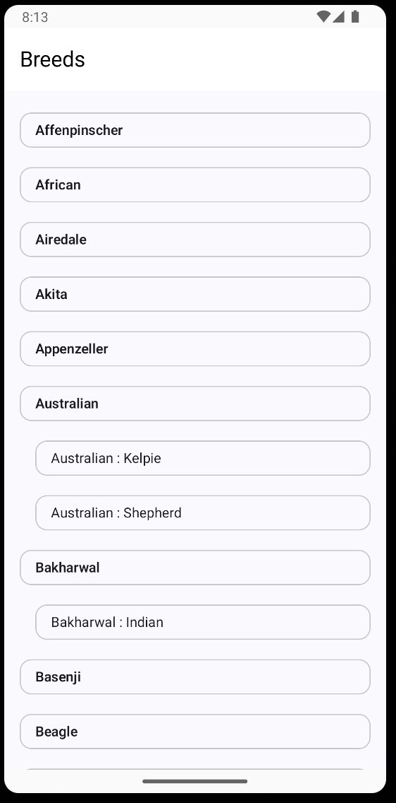
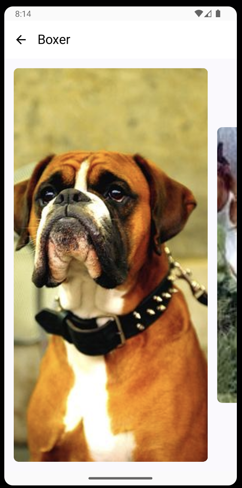

# Pawpedia App

## About the App

This app showcases a list of dog breeds and sub-breeds. The main screen displays a list of all available breeds. When the user taps a breed or sub-breed, they are taken to a new screen where 10 random images of the selected breed or sub-breed are displayed.

## Features

- **Breed & Sub-breed List**: Displays a list of breeds and sub-breeds.

- **Image Display**: Once a breed or sub-breed is selected, 10 random images of that breed/sub-breed are shown on the next screen.

## Tech Stack

- **Single Activity Architecture**: The app follows a **Single Activity** approach, making it efficient and simple to navigate.
- **Jetpack Compose**: The app's UI is built using **Jetpack Compose**, Google's modern UI toolkit for Android.
- **Kotlin Coroutines**: Asynchronous operations are handled by **Kotlin Coroutines**, ensuring smooth background tasks.
- **Retrofit**: **Retrofit** is used for communication with the backend server to fetch breed data and images.
- **Compose Navigation**: Navigation between screens is managed using the **Compose Navigation library**, with a small abstraction to enable navigation from **ViewModel** classes, making it testable and modular.
- **Testing**: For testing, **JUnit** and **Mockk** are used to ensure code reliability.

## App Architecture

- **Clean Architecture**: The app follows the principles of **Clean Architecture**, separating concerns into different layers (presentation, domain, and data).
- **Packaging by Feature**: Features are organized by their respective functionality, making the project modular and scalable.
- **MVI (Model-View-Intent)**: The presentation layer utilizes the **MVI** pattern, promoting a unidirectional data flow to keep UI logic clear and easy to manage.

### Decisions
- While Clean Architecture is followed, **interfaces** were not created for every class (like mappers) due to the small scale of the project. For this scope, the overhead wasn't necessary, and simpler implementations were preferred.

## Testing

- **Unit Tests**: **JUnit** was used to write unit tests, ensuring that the business logic works correctly.
- **Mocking**: **Mockk** was used to mock dependencies in unit tests to isolate the components being tested.

### Limitations:
Due to time constraints, some additional tests were not included:
- No **robolectric tests** or **UI tests** for screen interaction.
- **Unit tests** for repository, use case, and some parts of the ViewModel were not covered.

If more time were available, the following tests would be added:
- **Robolectric Tests** for Android-specific components.
- **UI Tests** to check the visual correctness of the screens.
- **Unit Tests** for the repository and use case layers to ensure the app’s data and business logic are thoroughly tested.
- **Snapshot Tests** to verify the UI layout consistently.
